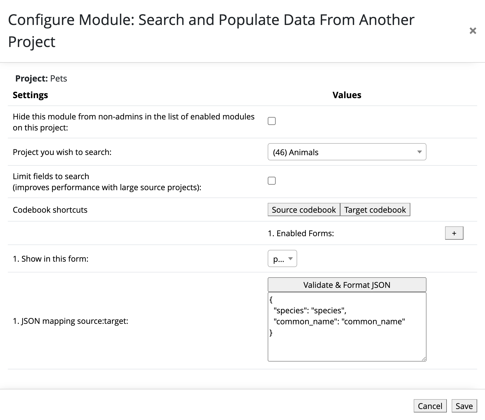
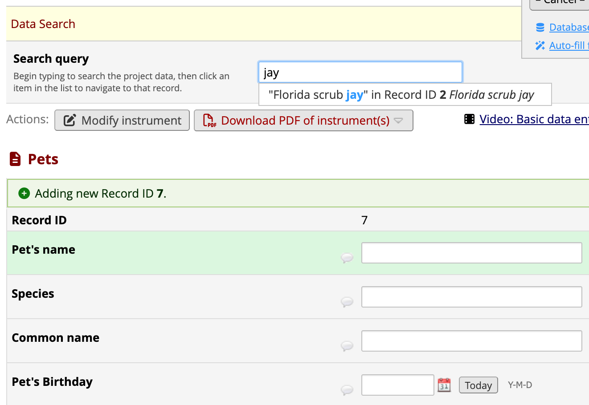
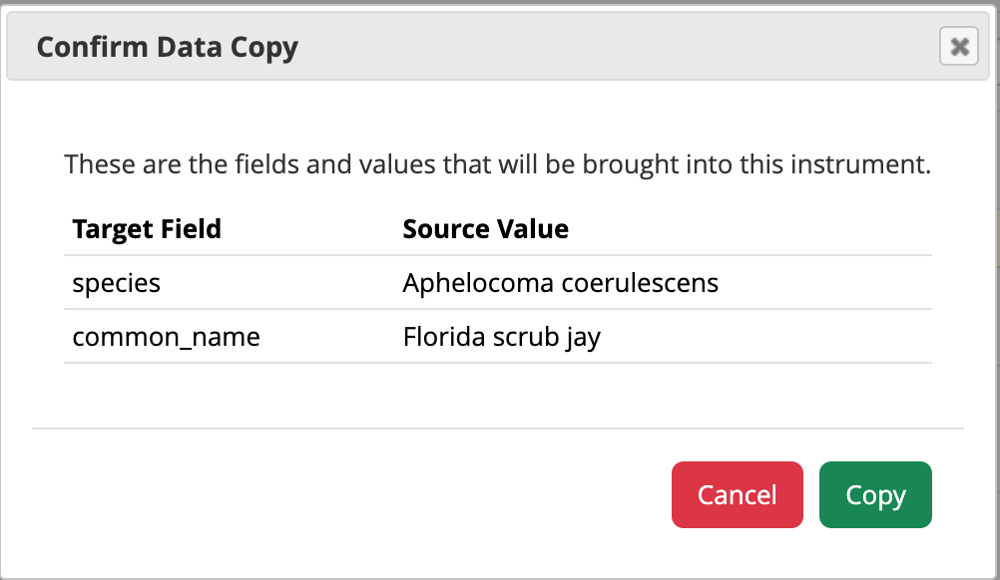
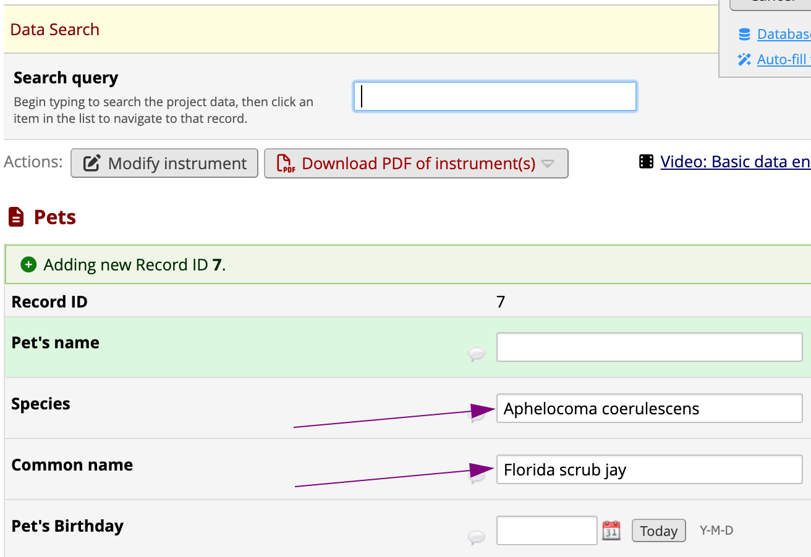

# Search and Populate Data From Another Project

A REDCap Module to search another project for data to populate fields into the current form. This module embeds REDCap's Search Query functionality into a data entry page enabling searches of _another_ project to populate fields on the current data entry page.

## Limitations
This module does not support source projects which have multiple arms. All queries of the source project will be against arm 1 of the source project.

## Prerequisites
- REDCap Standard 14.6.4+
- REDCap LTS 15.0.9+

## Easy Installation
- Obtain this module from the Consortium [REDCap Repo](https://redcap.vanderbilt.edu/consortium/modules/index.php) from the control center.

## Manual Installation
- Clone this repo into `<redcap-root>/modules/search_and_populate_data_from_another_project_v0.0.0`.
- Go to **Control Center > External Modules** and enable _Search and Populate Data From Another Project_.
- For each project you want to use this module, go to the project home page, click on **Manage External Modules** link, and then enable _Search and Populate Data From Another Project_ for that project.

## Configuration
Access **Manage External Modules** section of your project, click on _Search and Populate Data From Another Project_'s configure button, and save settings in order to specify the forms where the query box should be visible and provide the field mapping for each of those forms.

- **Project you wish to search**: The source project you will be searching and pulling values from.
    - **Note**: You may only select source projects to which you have access, but user permissions are _not_ checked while the module is used; by defining a source project you are granting access to the data contained in its mapped fields for everyone with access to the target project, _even for users without access to the source project_.
- **Limit fields to search**: Require selection of a single field to search from the source project.
    - Improves performance with large source projects
- **Place cursor in the search query field when the page loads**: Automatically focuses the search box so users can start typing immediately.
- **Enabled forms**
    - **Show in this form**: The instrument the following mapping will be applied to.
    - **JSON mapping source:target**: JSON which maps `source_field_names` from the source project to `target_field_names` in your current project.

## Troubleshooting
This module fails quietly if there is a configuration or data error. A bad field mapping or a renamed form usually won't throw an error, but each failure produces a distinct, recognizable pattern in the search box or the confirmation dialog. If you notice one of the following, here's the likely cause.

- **The search box does not appear at the top of the intended form.**
  The instrument isn't listed as an **Enabled Forms > Show in this form** entry for this module (or the module isn't enabled for this project at all). This most often happens after a form is renamed: the module's configuration still has the form's *old* unique name saved, which no longer matches the form's current unique name. Reopen **Manage External Modules > configure** and re-select the form.

- **All the target fields are listed in the confirmation dialog, but one shows no data.**
  The mapping entry itself is fine — the module found the source field and knows where to put it — but the matched source record genuinely has no value in that field, in any event or repeating instance. Check the record in the source project directly to confirm.

- **All the target fields are listed and show data in the confirmation dialog, but one of them is still blank after pressing Copy.**
  The value made it back from the source project, but pasting it into the target field failed. Likely causes: the *target* field name in the mapping has a typo, or refers to a field that was renamed or removed from the form; the field is a type the paste logic can't fill this way (e.g. a Notes field); or, for a radio/dropdown field, the source and target projects use different coded values for what looks like the same option.

- **One of the target fields is missing from the confirmation dialog entirely.**
  The *source* field name in the mapping has a typo, or refers to a field that was renamed or removed in the source project. The module never receives a value for a source field it can't find, so no row is generated for it at all.

## Testing with the example projects
The `examples` directory contains a pair of small REDCap projects you can import to try out the module without needing real data:

- `examples/Test_1_source_project_Animals.xml` &mdash; **Animals**, the _source_ project. Each record is a species with `species` and `common_name` text fields.
- `examples/Test_1_target_project_Pets.xml` &mdash; **Pets**, the _target_ project. Each record is a pet with `name` and `birthday` fields, plus `species` and `common_name` fields to be populated from Animals.
- `examples/field_mapping_for_test_1_pets.json` &mdash; the field mapping to paste into the module's configuration, mapping the source project's `species` and `common_name` fields to the target project's fields of the same names.

To try it out:

1. In REDCap, go to **My Projects > New Project** and use **Upload a REDCap project XML file** to create a project from `examples/Test_1_source_project_Animals.xml`. Repeat for `examples/Test_1_target_project_Pets.xml`. This gives you an **Animals** project and a **Pets** project, each pre-loaded with sample records.
2. Enable _Search and Populate Data From Another Project_ for the **Pets** project (see [Manual Installation](#manual-installation)/[Easy Installation](#easy-installation) above if the module isn't installed yet).
3. Open **Pets > Manage External Modules** and click the module's configure button. Set:
    - **Project you wish to search**: Animals
    - **Enabled Forms > Show in this form**: `pets`
    - **Enabled Forms > JSON mapping source:target**: the contents of `examples/field_mapping_for_test_1_pets.json`

   Your configuration should look like this:

   
4. Save, then open a record's **Pets** form in the Pets project. A search box will appear at the top of the form.
5. Type part of a species or common name from the Animals project (e.g. `Gopher Tortoise`) into the search box and select the matching result.
6. Confirm the copy in the dialog that appears &mdash; the record's `species` and `common_name` fields should be populated from the matched Animals record.

Here's what steps 4-6 look like in practice:

